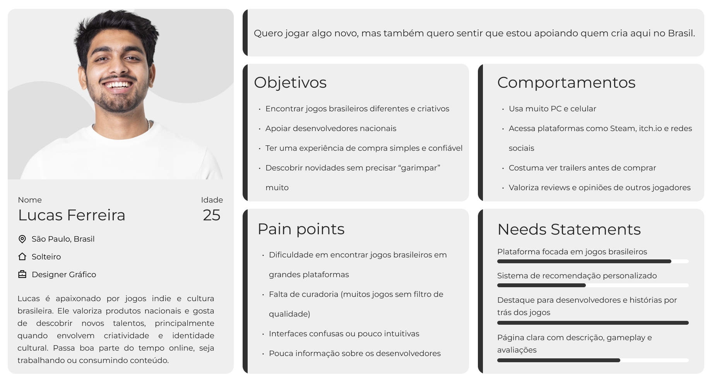

# Iara Games - Fase 2

#  A EVOLUÇÃO

Da sprint 1 para a sprint 2, o grupo evoluiu a plataforma Iara Games a partir de melhorias significativas. Como principal ponto de atenção, aprimoramos melhor os aspectos da nossa identidade visual, realizando ajustes na paleta de cores e incorporando uma texturização de água ao fundo. Aplicamos uma variação de tonalidade ao longo da navegação, onde, quanto mais profunda a página, mais escuro se torna o layout, assim como as águas de um rio.

Também acrescentamos um botão de pesquisa para facilitar a busca por novos jogos, além da criação de um formulário e da reorganização do layout dos cards, tornando a experiência mais completa e funcional.

## PERSONA

Lucas Ferreira, 25 anos, é um designer gráfico de São Paulo apaixonado por jogos indie e cultura brasileira. Ele busca descobrir jogos nacionais de forma prática, valorizando recomendações, reviews e uma experiência de navegação simples.

No entanto, enfrenta dificuldades em encontrar jogos brasileiros em grandes plataformas, devido à falta de curadoria e organização. Por isso, precisa de uma solução que centralize esses jogos, ofereça recomendações personalizadas e destaque os desenvolvedores, tornando a experiência mais clara e confiável.

## ESG

A Iara Games é uma plataforma voltada à curadoria, divulgação e acesso a jogos desenvolvidos por criadores brasileiros.

Centralizamos esses conteúdos em um único local, a iniciativa contribui para o fortalecimento do ecossistema nacional de games e da economia criativa. 

Nesse contexto, é possível analisar a relação com os princípios de ESG (Environmental, Social and Governance).

### ASPECTO AMBIENTAL

A Iara Games apresenta uma contribuição indireta, característica de plataformas digitais. Por não depender de mídia física para distribuição, reduz impactos relacionados à produção de materiais, logística e descarte.

Além disso, a plataforma incentiva a presença de jogos com temáticas ambientais, promovendo a conscientização dos usuários sobre sustentabilidade e preservação de recursos naturais.

### PILAR SOCIAL

O aspecto mais importante para a Iara Games, a plataforma contribui para:

- Valorização de desenvolvedores brasileiros, ampliando a visibilidade no mercado
- Fomento à economia criativa nacional, especialmente para estúdios independentes
- Democratização do acesso a jogos produzidos no Brasil
- Fortalecimento da cultura local, ao evidenciar narrativas, estéticas e referências brasileiras
- Dessa forma, promovemos inclusão econômica e cultural, alinhando-se diretamente aos objetivos sociais do ESG.

### PILAR DA GOVERNANÇA

A plataforma pode se estruturar a partir de práticas que garantam:

- Transparência nos critérios de curadoria e recomendação de jogos
- Equidade na exposição de desenvolvedores, evitando favorecimento desigual
- Segurança e confiabilidade para usuários e criadores
- Ética na gestão de dados e conteúdos digitais
- Esses aspectos são fundamentais para assegurar um ambiente digital justo, responsável e sustentável.

A Iara Games é uma iniciativa que fortalece o ecossistema nacional de games através de acesso, visibilidade e distribuição mais democrática.

## ESTRUTURA E LAYOUT

### HTML SEMANTICO

### LAYOUT COM GRIDS

### DESENVOLVIMENTO DA PÁGINA "SUPORTE"

### FORMULÁRIOS

#### FORMULÁRIO DE SUPORTE

#### FORMULÁRIO PARA DESENVOLVEDORES DE JOGOS

## LINKS

 - [VIDEO PITCH](#)
 - [GitHub](https://github.com/fabriciogallo/iara-games/)
 - [Projeto](https://fabriciogallo.github.io/iara-games/)
