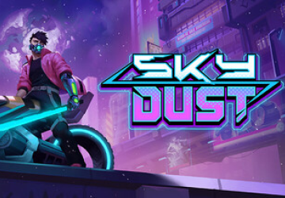

# Iara Games

A Iara Games é uma plataforma dedicada à divulgação de jogos desenvolvidos por Game Designers brasileiros. Nosso objetivo é ampliar a visibilidade de projetos nacionais e facilitar a conexão entre desenvolvedores e público.

Atuamos como um espaço de curadoria e exposição, reunindo produções independentes e autorais feitas no Brasil. A proposta é fortalecer o ecossistema criativo nacional, oferecendo um canal estruturado para apresentar jogos, compartilhar portfólios e destacar novos talentos.

Inspirada no nome da Iara, a plataforma carrega a ideia de identidade brasileira, mas com foco prático: criar oportunidades e dar espaço para quem desenvolve jogos no país.

## Refêrencias

#### STEAM

#### gog

#### Epic

## Design

### Definição e justificativa

#### Cores do Brasil, utilizando amarelo como destaque:

A interface utiliza uma paleta inspirada nas cores do Brasil, reforçando a proposta da plataforma de valorizar jogos desenvolvidos no país. O amarelo aparece como cor de destaque para ações importantes e elementos de navegação, criando contraste com o fundo escuro e ajudando a direcionar a atenção do usuário. Além de fortalecer a identidade visual da plataforma, essa escolha conecta o produto à cultura brasileira de forma sutil e reconhecível.

#### Mapa mostrando jogos desenvolvidos por estado:

Para reforçar a ideia de um ecossistema nacional de desenvolvimento de jogos, a plataforma apresenta um mapa do Brasil que destaca de onde vêm os jogos publicados. Esse recurso transforma a descoberta em algo mais contextual, permitindo que o usuário explore títulos a partir de suas regiões de origem. Mais do que um elemento visual, o mapa funciona como uma forma de evidenciar a diversidade da produção de games no país.

#### Logo que faz conexão entre jogos e a Iara:

A identidade visual parte de um símbolo que conecta dois universos: o dos jogos e o da Iara, figura presente no imaginário brasileiro. A forma da marca sugere movimento e fluidez, remetendo à ideia de descoberta e navegação entre diferentes jogos. Ao mesmo tempo, cria uma identidade própria para a plataforma, associando o nome Iara a um espaço dedicado a revelar e divulgar a produção de game designers brasileiros.

## Paleta de Cores

| Cor             | Hex                                                                |
| ----------------- | ------------------------------------------------------------------ |
| Primária |  #FFCB20 |
| Secundária |  #2550FF |
| Branco |  #FFFFFF |
| Preto |  #000000 |

## Aplicação e explicação de cuidados de usabilidade e acessibilidade

Durante o desenvolvimento da interface, foram considerados alguns princípios de usabilidade e acessibilidade para tornar a navegação mais clara e confortável para diferentes perfis de usuários. A estrutura da página foi organizada em blocos bem definidos, como seções de jogos populares, ofertas e exploração por região, permitindo que o usuário escaneie rapidamente o conteúdo e encontre o que procura sem esforço.

O contraste entre o fundo escuro e os elementos de destaque, como botões e informações principais, foi pensado para melhorar a legibilidade e facilitar a identificação das ações disponíveis. Botões como “Comprar jogo” e “Jogar” utilizam cores de destaque e tamanhos consistentes, ajudando o usuário a reconhecer rapidamente quais elementos são interativos.

Também foram utilizados cards para apresentar os jogos, agrupando imagem, título, preço e ação em um mesmo espaço visual. Esse padrão cria consistência na navegação e facilita o reconhecimento das informações, evitando sobrecarga visual.

Além disso, os textos possuem hierarquia clara entre títulos, descrições e informações complementares, contribuindo para uma leitura mais fluida. Esses cuidados ajudam a tornar a interface mais intuitiva, acessível e alinhada com boas práticas de experiência do usuário.
## Layout

## Roadmap

- Additional browser support

- Add more integrations

